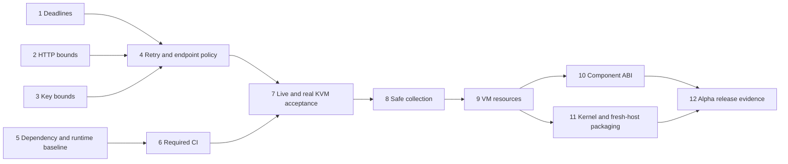

# Agent OS v0.1 Completion Implementation Plan

> **For agentic workers:** REQUIRED SUB-SKILL: Use superpowers:executing-plans to execute the linked focused plans in dependency order. Steps use checkbox (`- [ ]`) syntax for tracking.

**Goal:** Deliver the complete original v0.1 workflow with live-model evidence, safe resource lifecycle, a capability-bound Wasm analyzer, and fresh-host release validation.

**Architecture:** Preserve the existing reducer, journal, broker, supervisor, and worker boundaries. Complete model reliability first, establish repeatable gates, then add resource collection, the minimal component ABI, and release packaging. Execute each work package as a separately reviewable change with its own red/green test cycle.

**Tech Stack:** Rust, Tokio, SQLite, Firecracker, pyenv-managed Python, Docker Compose; Wasmtime for the new component runtime.

**Spec:** [v0.1 completion design](../specs/2026-10-04-v01-completion-design.md), [repository review](../../reviews/2026-10-04-repository-review.md), and the original [build plan](../../../Agent_OS_v1_Build_Plan.md).

## Execution status — 2026-10-08

Packages 1–10 are complete. Package 7's live host and jailed runs and the real
KVM suites passed on 2026-10-08 ([evidence](../../evidence/README.md)), and its evidence is
checked automatically. Package 5's candidate guest passed real KVM acceptance at `f175de3`. Package 9 passed full KVM acceptance at `7955b96`, package 10 at `d33e82e`. Packages 11–12 remain open; package 11 has a [focused design](../specs/2026-10-09-kernel-and-installer-design.md).
The 2026-10-04 status below is historical.

## Execution status — 2026-10-04

Packages 1–4 are implemented and verified offline. Package 5 has scoped dependency
updates, pinned pyenv/Python, compatibility tests and a candidate guest recipe; its real
guest conformance/reproducibility gate remains open. Package 6 implements required
Compose/CI checks and accurate status documentation. Package 7's host and jailed harnesses
are verified with the local fake API, with acceptance/evidence tooling ready.

The user requested continuing offline and will provide live/KVM setup later. No real
provider or KVM run has been performed in this execution. Package 8 has been implemented
offline in the continued completion worktree. Packages 9–12 remain planned and require
focused designs and later acceptance gates. This is an offline reliability
milestone, not completed v0.1 acceptance. See [evidence collection](../../evidence/README.md).

## Global Constraints

- One local owner, one driver per home, serialized workspace changes.
- Docker Compose for build/test; offline tests make no paid API calls.
- `SUCCEEDED` requires protected verification of exactly the final workspace.
- One model send per attempt; requests possibly billed remain counted as uncertain.
- Capability checks, expected workspace versions, and durable receipts remain mandatory.
- Latest stable library versions are checked online before additions/updates, then resolved versions are recorded in `Cargo.lock`.
- Python development uses pyenv and a pinned current stable version. A new interpreter uses a new guest profile/image; old image digests remain immutable. Ruby is absent; use RVM if Ruby is introduced.
- Tests cover behavior, failure boundaries, and recovery. Commits have no co-author trailer.

## Review Focus

1. Old journals resume without changing recorded agent decisions: Task 4.
2. Retry waiting survives a crash, pause, cancel, revoke, and deadline expiry without extra sends: Task 4.
3. Chunked HTTP bodies and FIFO/device key paths cannot exhaust memory or block indefinitely: Tasks 2–3.
4. Terminal tasks with outstanding effects are retained by GC: Task 8.
5. Fake VM/live test skips never count as real isolation/provider acceptance: Tasks 6–7 and 12.

## Starting point and execution order

At reviewed commit `8c273b1`, host/offline and fake-jail suites passed; default rustfmt and strict Clippy failed. Real KVM and live Anthropic acceptance were not verified. Use the review as baseline evidence, not as a waiver for future tests.



Tasks 1–3 can be separate changes; native sequential execution is sufficient. Task 5's Python guest acceptance requires KVM. Do not hold the model fixes for a missing KVM runner: implement and test them offline, then keep their real acceptance gate open. No automatic sub-agent dispatch is part of this plan.

## Milestones and effort

| Milestone | Packages | Estimated engineering effort | Exit condition |
| --- | --- | --- | --- |
| A. Reliable live workflow | 1–7 | 8–13 days | Bounded/correct model behavior, required CI, live host and jailed repair/replay evidence |
| B. Repeated operation | 8–9 | 5–8 days | Safe GC, no false checkpoints under ENOSPC, measured disk/I/O/memory limits |
| C. Full v0.1 alpha | 10–12 | 10–16 days | Granted-only component analysis and repeatable fresh-host release across two snapshots |

Total provisional effort: 23–37 engineering days. This is effort, not calendar commitment; obtaining credentials, a KVM runner, and a fresh supported host can add elapsed time. Re-estimate after Task 7 using actual provider/jail behavior.

## Task 1: Enforce model task deadlines

**Dependencies:** none.

**Files:** `crates/agentos-engine/src/model/executor.rs`; new `crates/agentos-engine/tests/review_deadline_probe.rs`; existing model executor, forfeit, and crash tests.

**Interfaces:** Preserve `ModelProvider::complete` and `Executor::run`; timeout yields existing unresolved outcome.

- [x] Execute the complete [model deadline plan](2026-10-04-model-deadline-enforcement.md), using the preserved regression to prove the defect before fixing it.
- [x] Confirm timeout retains uncertain usage, pre-expired calls make no send, and completed retained responses replay without another send.
- [x] Commit only the focused code/tests and its documentation.

**Gate:** focused regression and host/fake-jail suites pass. Do not silently settle/release an interrupted sent request.

## Task 2: Bound successful and rejected provider responses

**Dependencies:** none; compatible with Task 1.

**Files:** `crates/agentos-engine/src/model/anthropic.rs`, `crates/agentos-engine/tests/provider.rs`, `crates/agentos-engine/tests/common/http.rs`.

**Interfaces:** Keep `ProviderResult` unchanged in this package. Successful response limit is 4 MiB; definite errors retain a 4096-byte prefix and status.

- [x] Execute Task 1 of [bounded model I/O](2026-10-04-bounded-model-io.md), including fixed-length and chunked limit tests.
- [x] Verify oversized success is unresolved/possibly billed; oversized definite error remains a rejected status and stops downloading.
- [x] Keep no-redirect and no-client-retry tests green.

**Gate:** collector accepts exactly the cap, rejects cap+1, and error responses do not require an unbounded body read.

## Task 3: Bound key file reads

**Dependencies:** none.

**Files:** new `crates/agentos-cli/src/secrets.rs`; `crates/agentos-cli/src/{lib,home}.rs`; CLI manifest and tests.

**Interfaces:** New private `read_key_file(&Path) -> io::Result<String>`; key size limit 4096 bytes. Key construction/redaction remains existing `ApiKey` behavior.

- [x] Execute Task 2 of [bounded model I/O](2026-10-04-bounded-model-io.md).
- [x] Test regular-file boundary, oversize, invalid UTF-8, symlink, FIFO, directory, and device paths.
- [x] Confirm errors happen before a task starts and never quote key contents.

**Gate:** normal key files work; hostile/nonregular inputs return promptly; existing secret-exclusion CLI tests pass.

## Task 4: Add versioned model failure, retry, and endpoint policy

**Dependencies:** 1–3.

**Files:** new `crates/agentos-engine/src/model/policy.rs`; `crates/agentos-engine/src/{agent,journal,runner,steps}.rs`; `crates/agentos-engine/src/model/{provider,anthropic,executor}.rs`; `crates/agentos-store/src/db.rs`; `crates/agentos-cli/src/{drive,home}.rs`; `crates/agentos-cli/src/commands/{submit,inspect}.rs`; `crates/agentos-engine/src/export.rs`; provider, agent, flow, crash-matrix and CLI tests.

**Interfaces:** `ModelFailureClass::{Permanent,Transient}`; optional typed failure metadata on `Observation::ModelCallFailed` with serde defaults; `Submitted.model_policy_version`, `model_limits_version`, `model_endpoint`; owned `ModelRetryScheduled` event `{failed_effect_id,retry_turn,not_before_ts,policy_version}`. Preserve old policy 0 replay. Policy 1 is recorded for new submissions.

- [x] Write a focused policy implementation plan from the completion design before changing the journal/agent interfaces. Include actual serialization fixtures for policy 0 and 1 and the expected turn sequence for each.
- [x] Add red cases: 401 sends once and fails with auth reason; 429 waits before a new effect; 529 recovers after a transient sequence; invalid/HTTP-date/integer `Retry-After`; transport loss stays uncertain; retry past deadline sends nothing; cancel/pause/revoke while waiting sends nothing more.
- [x] Add crashes after recording the retry schedule, after journaling the retry turn, and before dispatch. Assert the resumed request uses the original not-before time and a new effect/reservation exactly once.
- [x] Add endpoint cases: omitted override uses recorded URL; different flag/env URL exits 2 before key read/task mutation; old missing endpoint defaults only to official endpoint; status/export match submission.
- [x] Enforce 8 MiB serialized-request cap before blob/turn/reservation creation. Test exact boundary and cap+1, with a specific context-size failure.
- [x] Implement permanent/transient classification, durable 2–60-second backoff, both `Retry-After` forms, bounded polling, and compatibility rules from the spec. Add `httpdate` only if needed; the checked current version is [1.0.3](https://docs.rs/crate/httpdate/latest).
- [x] Run the package gate and update README error/retry/compatibility documentation.

```sh
docker compose run --rm test cargo test -p agentos-engine --locked --test provider --test model_agent --test model_flow --test model_crash_matrix --test recover_forfeit
docker compose run --rm test cargo test -p agentos-cli --test cli --locked
```

**Gate:** old journal fixtures replay identically; every new send has its own reservation; permanent failures stop; scheduled waits survive all crash/interruption cases. Never infer billing certainty from merely dropping a local future.

## Task 5: Refresh dependencies and align Python development

**Dependencies:** no code dependency; finish before Task 7 guest acceptance.

**Files:** `Cargo.toml`, `Cargo.lock`, `Dockerfile`, `rust-toolchain.toml`; new `.python-version`; new versioned recipe under `guest/`; interpreter provenance in `scripts/build-guest-image.sh` and image metadata.

- [x] Recheck official latest versions online. On 2026-10-04 the checked candidates are [Tokio 1.53.2](https://docs.rs/crate/tokio/latest), [UUID 1.27.0](https://docs.rs/crate/uuid/latest), and [Python 3.14.8](https://www.python.org/downloads/). Rust remains [1.98.1](https://doc.rust-lang.org/stable/releases.html).
- [x] Update Tokio and UUID as scoped changes, remove unused `jsonschema` workspace declaration, and preserve reviewed locked dependencies otherwise.
- [x] Pin pyenv itself by reviewed release/commit and Python source/version/checksum in the Docker development image; record `.python-version`. Add a new Python guest recipe rather than changing an existing registered digest.
- [x] Add fixture/profile compatibility cases for both interpreters. Verify two clean builds of the new guest image are byte-identical and interpreter provenance is correct.

**Task 5 result (2026-10-08).** At `f175de3` the candidate built twice byte-identically and passed both KVM suites. Interpreter provenance is checked inside the guest by `the_guest_interpreter_is_the_one_the_image_manifest_records`, which caught that an earlier passing run had executed Debian's 3.11.2. The candidate is accepted; it is not yet the default, and its interpreter is a copy of the pinned pyenv build rather than an independent source rebuild (package 11).

```sh
docker compose run --rm test cargo update -p tokio --precise 1.53.2
docker compose run --rm test cargo update -p uuid --precise 1.27.0
docker compose build
docker compose run --rm test pyenv exec python --version
docker compose run --rm test cargo test --workspace --locked
```

**Gate:** scoped Rust updates pass existing tests; pyenv selects the pinned interpreter; new guest passes real conformance/reproducibility before it becomes the alpha default. No Ruby installation is required.

## Task 6: Establish required CI and accurate progress docs

**Dependencies:** 1–5 code changes can land incrementally; runtime/KVM gate may remain separately pending.

**Files:** new `.github/workflows/ci.yml`, new `scripts/check.sh`; formatting/lint fixes in files named by the review and any subsequent diagnostics; `README.md`, `Agent_OS_v1_Build_Plan.md`, `docs/index.html`, Phase 4 spec/plan status.

- [x] Run default rustfmt once as an isolated formatting commit. Resolve Clippy findings without changing state/recovery behavior; use a narrowly documented allowance when boxing/changing a protocol type only for lint would create needless churn.
- [x] Make `scripts/check.sh` fail on the first failed required command and run these four checks:

```sh
docker compose run --rm test cargo fmt --all -- --check
docker compose run --rm test cargo clippy --workspace --all-targets --locked -- -D warnings
docker compose run --rm test cargo test --workspace --locked
docker compose run --rm -e AGENTOS_TEST_WORKER=firecracker-fake -e AGENTOS_TEST_JAIL=fake test cargo test --workspace --locked
```

- [x] Add PR/push workflow jobs using the same Compose commands. Give jobs separate project names/target caches when concurrency would collide. Prove an intentionally failing fixture/check makes the workflow fail, then remove the injected failure.
- [x] Add manual KVM/live evidence jobs with fail-if-requested-but-unavailable semantics. Never enable privileged or credentialed jobs for untrusted fork code.
- [x] Update progress claims to distinguish implementation, offline acceptance, real KVM acceptance, and live acceptance; keep historical plans as historical with a current status note.

**Gate:** all four required commands green; evidence tiers explicitly enabled and recorded; no stale "fake agent only" landing-page claim.

## Task 7: Close Phase 4 with real acceptance evidence

**Dependencies:** model policy and required offline gates; KVM host and provider credentials for dependent runs.

**Files:** `crates/agentos-engine/tests/live_model.rs`, `crates/agentos-engine/tests/common/{live,kvm}.rs`; new `scripts/acceptance.sh`; sanitized evidence under `docs/evidence/`; versioned recordings under `fixtures/transcripts/`.

- [x] Refactor live harness to accept recorded worker configuration; add host and jailed variants. Test both harness paths against the local fake API first.
- [x] Run a real host repair and jailed repair with bounded contract budgets and a mounted regular key file. Save recordings where they can be exported from the Compose target volume.
- [x] Replay the recordings without network and compare request digests, call count, workspace digest, protected profile evidence, and exported patch.
- [x] Run real KVM hostile profiles, conformance, and the full real-worker crash suite:

```sh
docker compose run --rm test-kvm cargo test --workspace --locked
docker compose run --rm -e AGENTOS_TEST_WORKER=firecracker test-kvm cargo test --workspace --locked
```

- [x] Check evidence schema and secret exclusion; record failed attempts alongside successes. Re-estimate remaining delivery effort from results.

**Task 7 result (2026-10-08).** `cargo test --test evidence` checks secret exclusion (decoding byte-encoded response bodies) and cross-file agreement of every promoted run in the default tier; the live harness scans its outputs for the exact key bytes before writing a success report. The one failed KVM attempt is kept beside the passing run. The host run's single `Denied` was an `InvalidPatch` refusal of a miscounted hunk, now pinned by a regression test.

**Re-estimate from Task 7 results.** The provider, the jail and recovery behaved as designed on their first real runs; the only real-environment failure was a test assumption (an environment dump that is empty under guest init). Live runs took 4–5 model calls and about 16 seconds each. Remaining effort, replacing Milestones B and C above:

| Package | Estimate | Main risk |
| --- | --- | --- |
| 5. Candidate guest reproducibility and conformance | 0.5–1 day | Image build nondeterminism under the new interpreter |
| 9. Contract-driven VM disks and I/O | 3–5 days | Measuring page-cache and cgroup pressure reliably |
| 10. Component analyzer | 4–6 days | WIT world scope and Wasmtime resource limits |
| 11. Kernel provenance and fresh-host installer | 3–5 days | Access to a fresh supported host |
| 12. Alpha evidence and release candidate | 2–3 days | Every gate rerun at one frozen commit |

Total remaining: 12.5–20 engineering days. The original estimate for Milestones B and C was 15–24 days, but it covered packages 8–12; package 8 is now done, and package 5's remaining gate belonged to Milestone A, so the two figures are not directly comparable.

**Gate:** actual live success and offline replay, actual jailed worker isolation/recovery evidence. Missing setup keeps the gate open; no skipped test establishes acceptance.

## Task 8: Add conservative GC and host publication failure tests

**Dependencies:** 7; may be developed offline while obtaining acceptance infrastructure.

**Files:** new `crates/agentos-engine/src/gc.rs`, `crates/agentos-cli/src/commands/gc.rs`, `crates/agentos-engine/tests/gc.rs`; CLI args/dispatch; `crates/agentos-engine/src/{model/executor,job,recover}.rs`; `crates/agentos-store/src/blob.rs`; new store publication tests.

**Interfaces:** proposed `agentos gc --dry-run` and `agentos gc`; shared collector produces a bounded JSON report of owned candidates/deletions/refusals. No task/linked artifact deletion in this first collector.

- [x] Write focused GC design and implementation plan with exact ownership/reference predicates and deletion order before destructive implementation.
- [x] Add cases: live job/inspection excluded; terminal task with outstanding effects excluded; pending-cancel task retained; missing receipt retained; settled retained model response collectable; repeated collection idempotent; symlink candidate refused; export unchanged after collection.
- [x] Hold driver lock, revalidate workspace/job locks and references, and remove only reconstructible owned transient paths.
- [x] Inject ENOSPC before rename/fsync/reference publication using an isolated bounded filesystem or explicit publication fault seam. Recover after clearing the fault and assert no false success/reference.

Implemented and verified offline through the [focused plan](2026-10-04-conservative-gc.md).
Independent review fixes add descriptor-relative deletion, durable interruption tickets,
candidate identity pins and historical-parent handling. Actual read-only bind mounts and
oversized malformed-receipt errors also have regressions. The collector deliberately
retains the whole pass after a validation refusal and leaves inspection/cgroup cleanup
to existing worker reconciliation. See the [review record](../../reviews/2026-10-04-conservative-gc-review.md).

```sh
docker compose run --rm test cargo test -p agentos-engine --test gc --locked
docker compose run --rm test cargo test -p agentos-store --locked
docker compose run --rm test cargo test -p agentos-engine --locked --test export --test crash_matrix --test model_crash_matrix
```

**Gate:** exports and recovery remain valid; live/outstanding work is never collected; publication failure cannot claim a durable checkpoint.

## Task 9: Make VM disks and I/O contract-driven

**Dependencies:** 8 and real KVM acceptance environment.

**Files:** `crates/agentos-core/src/contract.rs`, `crates/agentos-engine/src/{firecracker,jail}.rs`, CLI home/submit/export, contract/worker/KVM tests; profile registration validation.

- [x] Write focused resource-limit spec/plan: optional disk/scratch/bandwidth/IOPS fields, explicit ranges, old defaults, recorded provenance, and preflight capacity checks.
- [x] Test old-contract defaults (1024/512 MiB), minimum/maximum/overflow, full disk, actual I/O rate enforcement, and crash/resume with recorded limits.
- [x] Measure page-cache/cgroup pressure under heavy I/O; choose documented overhead from measurements and assert infrastructure OOM cannot accept verification.
- [x] Reject guest profiles that require unsupported executable mode transport; test interpreter-based commands continue to work. Keep a protocol-mode upgrade outside this package.

**Task 9 result (2026-10-09).** Implemented per the [focused design](../specs/2026-10-08-vm-resources-design.md) and [plan](2026-10-08-vm-resources.md). Two decisions changed from the first draft on measurements: images stay sparse (preallocation would reserve about all free space under the test container), and the rate minimums rose to 32 MiB/s and 5000 operations/s (the first ones could not boot). A full host disk is reported as `host disk: …`. Full KVM acceptance passed at `7955b96`.

```sh
docker compose run --rm test cargo test -p agentos-core --locked
docker compose run --rm -e AGENTOS_TEST_WORKER=firecracker test-kvm cargo test -p agentos-engine --locked --test kvm_tier --test worker_conformance --test crash_matrix
```

**Gate:** real limits match recorded contracts; defaults replay old tasks; resource failure is visible and never accepted as verification success.

## Task 10: Implement the minimal component analyzer

**Dependencies:** 6 and 9. Freeze component ABI after reliability/resource interfaces are stable.

**Files:** new `wit/agentos-v1.wit`, `crates/agentos-component/{Cargo.toml,src/lib.rs,tests/analyzer.rs}`, analyzer fixture, core effect/capability types, engine routing/retention/export, store and recovery tests.

- [x] Write component spec and focused plan defining the exact WIT world, scoped resource handles, effect request/result serialization, and failure/recovery semantics before adding the crate.
- [x] Recheck/pin Wasmtime; current checked release is [49.0.2](https://docs.rs/crate/wasmtime/latest). Import no ambient filesystem/network WASI interfaces.
- [x] Add red cases: granted object read succeeds; ungranted/revoked/wrong-task handle fails; infinite loop interrupted; memory growth bounded; report oversize/malformed rejected; controller crash after output retention replays without reexecution.
- [x] Integrate through broker/effect lifecycle; reference analyzer emits an exported bounded report. Its result cannot produce `VerifyPassed`.

**Task 10 result (2026-10-09).** Implemented per the [focused design](../specs/2026-10-08-component-analyzer-design.md) and [plan](2026-10-09-component-analyzer.md): Wasmtime 49.0.2 with no WASI, the `agentos:analyzer` world, a registry, one advisory analysis per task after the snapshot, broker checks on every read, retention and recovery at every crash point, GC of settled retention, and the report in the export. Full KVM acceptance passed at `d33e82e`.

```sh
docker compose run --rm test cargo test -p agentos-component --locked
docker compose run --rm test cargo test --workspace --locked
```

**Gate:** ABI behavior and interruption proven; component report is recoverable and capability-bound; protected verification remains the only success path.

## Task 11: Build kernel provenance and fresh-host installation

**Dependencies:** 5 and 9; may proceed after their interfaces stabilize while Task 10 is implemented.

**Files:** new pinned guest kernel source/config/toolchain recipe; `scripts/build-guest-image.sh`; new `scripts/{install,smoke-install}.sh`; release artifact manifest; Docker/Compose packaging; supported-host documentation.

- [ ] Pin kernel source/checksum/config and build toolchain; build twice in independent directories and compare guest artifacts. Record provenance with interpreter and agent versions.
- [ ] Specify a Docker-based installer with atomic staging, checksum verification, no overwrite of existing homes, idempotent version installation, and actionable KVM/cgroup refusal.
- [ ] Add red installer cases: corrupted checksum, existing home, interrupted staging, unsupported architecture, missing KVM, nondelegated cgroups. Test no partial install after refusal.
- [ ] On a fresh supported host, install, register images/profile, run jailed fixture, kill/resume, and export; compare exported patch/evidence against recorded inputs.

```sh
docker compose run --rm test-kvm sh scripts/build-guest-image.sh guest/python-stdlib-v1 build/guest-images/python-stdlib-v1 --verify
docker compose run --rm test sh scripts/install.sh --self-test
sh scripts/smoke-install.sh
```

The image command uses the existing recipe to establish the baseline; the new source-kernel/current-Python recipe gets the same independent build comparison once introduced. The fresh-host smoke script itself provisions/uses Compose and refuses unsuitable setup.

**Gate:** reproducible/provenanced artifacts; clean-host workflow works without undocumented manual repairs; existing homes are preserved.

## Task 12: Publish the full alpha evidence and release candidate

**Dependencies:** 7–11.

**Files:** new second repository/profile/task fixture; `scripts/acceptance.sh`; `docs/evidence/`, supported-host/runbook docs, release workflow and checksums; README/build-plan status.

- [ ] Freeze a release commit and exact image/profile/component/model/policy versions.
- [ ] Run the four offline CI gates, real KVM full suite, both live worker variants/replays, component tests, image reproducibility, and fresh-host smoke at that commit.
- [ ] Demonstrate tasks across two distinct registered snapshots; publish successes, failures, settled/uncertain requests, limits, versions, durations, and exported patch/evidence digests.
- [ ] Verify evidence/recordings contain no key, full capability handle, or unintended secret file. Verify checksums from a clean download.
- [ ] Produce release candidate and release notes. Mark v0.1 complete only when every gate above has actual evidence; otherwise identify the remaining gate and keep its checkbox open.

**Gate:** a third party can reproduce the supported fresh-host workflow and inspect final-workspace evidence. Publishing a release is a separate action from creating this plan.

## Mandatory regression gate per implementation package

Write a failing behavioral test before changing its behavior, implement the smallest fix, run the focused tests, then the required offline gate. Any code change after a pass invalidates the corresponding result and needs rerunning. Run real KVM checks for VM/guest/resource changes; run gated live checks for provider compatibility changes. Keep commits focused and omit co-author trailers.

## Planning self-review

The packages cover all six review findings, the original missing Phase 4 acceptance, Phase 5, and Phase 6. Failure classes, policy identity, byte limits, GC ownership, and live evidence are specified in the linked design. The immediate deadline and bounded-I/O work have executable focused plans; packages that introduce new journal/GC/ABI/installer architecture begin by producing their own focused plans before code changes. No delivery date or implementation success is claimed.
