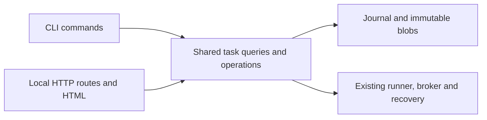

# Local web UI for Agent OS

Date: 2026-10-04
Status: design and ten-task native implementation approved by the owner. Implementation and offline browser acceptance complete; final independent branch review pending (see [review record](../../reviews/2026-10-04-local-web-ui-review.md)).
Base: `ddf4396` on `codex/v01-completion`.

## Intent and success criteria

The owner wants to run tasks and review patches/results. They accepted a local web UI,
launched with `agentos ui`, with task submission, monitoring, result review, and the
existing pause/resume/cancel operations. The agreed delivery order is a task list and
result viewer first, followed by submission and controls. A TUI is a possible later client.

This is a separate UI milestone. The existing [v0.1 completion design](2026-10-04-v01-completion-design.md)
excludes a web UI from its scope; this design does not mark the remaining completion
packages or real provider/KVM acceptance complete.

Success is a browser workflow that can submit an existing-format task contract, approve
exactly its recorded inputs and permissions, run an offline fixture task, review its
patch and final verification evidence, and download an export with the same patch and
evidence bytes as the CLI. Closing a tab does not stop a run. Restarting the UI server
permits explicit recovery through the existing journaled engine.

Assumptions: one local owner, one Agent OS home, repositories accessible on the server's
filesystem, and the existing one-driver-per-home rule. There is no remote deployment,
fleet scheduler, automatic patch application, chat interface, or browser terminal.

## Approach

Use Rust HTTP routes and server-rendered HTML with HTMX updates. This fits the existing
Rust/Tokio controller and avoids a separate frontend runtime or build pipeline. A TUI
would suit SSH monitoring, but browser layouts make contract review and patch/evidence
comparison easier. A separate JavaScript SPA would add an API and asset build system
without improving the first workflow enough to justify them.

Versions checked against primary documentation on 2026-10-04:

| Dependency | Checked version | Purpose |
| --- | --- | --- |
| [Axum](https://docs.rs/axum/latest/axum/) | 0.8.9 | Local HTTP routing |
| [Askama](https://docs.rs/askama/latest/askama/) | 0.16.1 | Typed HTML templates with escaping |
| [HTMX](https://htmx.org/docs/) | 2.0.11 | Partial refreshes and form responses |
| [tar](https://docs.rs/tar/latest/tar/) | 0.4.46 | Creating downloadable export archives |

Recheck versions when implementing and pin through the lockfile. Vendor the HTMX asset
with provenance/checksum; serve all scripts, CSS and fonts locally. No CDN is needed.
Reuse existing Tokio, serde, getrandom, tempfile and store/engine dependencies where
possible. Do not introduce Ruby or a new Python runtime for the UI.

## Shared application boundary

Keep the current workspace crates. Introduce an internal `app` module in `agentos-cli`
for task queries and operations, and a separate `ui` module for HTTP/session/rendering.
Existing CLI command modules become thin JSON-output adapters around shared operations.
Do not move unrelated worker, model, registry or recovery code.

Queries return typed task summaries, status, paged events and result views. Operations
return typed submission, control and export outcomes rather than printing. The CLI
preserves its existing JSON shapes and error exit codes. HTTP handlers never assemble
shell commands, write lifecycle SQL directly, or implement another state machine.

The application context contains home/configuration and a runner manager, not a shared
SQLite connection. Each blocking query opens its own store on the thread doing the
work. Long runs own their store, runtime and driver lock on a dedicated runner thread;
they must not hold a request open or share `&Db` across async server tasks. Bound the
blocking-query concurrency to four and admit at most one driver run per home.

### Pure review data

Current [CLI inspection](../../../crates/agentos-cli/src/commands/inspect.rs) prints queries
directly. Current [CLI export](../../../crates/agentos-cli/src/commands/export.rs) performs
journaled authorization, and [engine export](../../../crates/agentos-engine/src/export.rs)
writes an `Exported` audit event. Opening or polling a result page must do neither.

Factor the existing export collector into a reusable pure projection, with explicit
bounded reads for the web client. Reuse its patch ordering, integrity checks and
verification acceptance calculation; do not independently infer final verification
from a successful check. Use the store's pure `Db::check` for `artifact.export` on result
content, and its existing journaled authorization for explicit export creation.
Revoked or missing export authority disables result content/downloads with a reason.
Task metadata and contract review remain available as local owner inspection.

Normal GETs must leave task, effect, usage, capability and journal rows unchanged. UI
startup may initialize an empty home using the existing home-open behavior. Read-only
driver observation must not call `Home::try_lock`, which truncates an acquired lock
file; observe the existing lock without creating/truncating it. Observed availability
is advisory: the runner still acquires the real exclusive lock before admission.

## Screens and workflow

### Tasks

The home screen has a compact task table: goal, repository, recorded model/worker,
state, creation time and action usage. Show at most 50 rows per page, ordered by
creation time and task ID descending, with a cursor and state filter. Use a parameterized
store query rather than scanning task directories or loading every journal. Include an
empty state and a visible New task action once the submission increment is delivered.

### Task details and results

A task header shows the recorded state, current operation, worker/model, usage limits,
and available actions. Below it, tabs contain Overview, Patch, Verification and Events.
The patch is an escaped unified diff with file headings and addition/deletion styling;
do not claim that the concatenated export patch is a synthesized net diff. Verification
distinguishes check passed, result accepted for the final workspace, and interrupted
or failed checks. Display the final and verified workspace digests together.

Only `SUCCEEDED` with matching final/verified digests and accepted evidence earns a
verified-result label. `FAILED`, `CANCELLED`, pending cancellation and a passed check
that was not accepted remain distinct. Corrupt/missing artifacts produce an unavailable
result with an integrity error, not a successful empty patch. Running tasks can show
status and events; the first release shows full patch/verification review for terminal
tasks, matching current export eligibility.

Poll visible active-task status every two seconds and load events after the last shown
sequence, at most 100 events per request. Stop polling hidden tabs and terminal tasks
unless cancellation/outstanding effects still need attention. Polling failure preserves
the last successful display and shows its update time and a stale-state notice. Timeline
rows expose bounded summaries; raw model prompts/responses are reviewed through an
authorized export, not inserted into the page automatically.

Use restrained typography, clear table alignment and readable code panels. Layouts must
work at desktop and narrow browser widths. Every state/action has a text label; color
is supplementary. Forms, tabs and diff scrolling work by keyboard with visible focus.

### New task and approval

Accept pasted or uploaded contract JSON in the existing schema. The form shows the
server-side repository path and model/worker selection; it does not browse arbitrary
server files. Existing profiles/images are listed read-only. Model syntax and offline
fixtures match the CLI. Provider keys, endpoint and binary/jail configuration come from
server startup configuration and never from browser forms.

Create records validated inputs as a `READY` task without issuing capabilities or
sending model requests. Its review page uses the stored contract and staged input
digests, showing goal, editable paths, permissions, verification profile, limits,
model, worker and sandbox status. Approve and start is a separate deliberate POST bound
to the task ID and reviewed contract digest. Re-read the stored data and repeat worker
preflight before approval; if it fails, keep the task unapproved and show the reason.
No polling, navigation or form default grants approval.

The New task form issues and registers a session-scoped nonce; accept only known,
unexpired nonces. Coalesce duplicate Create requests while the server lives. Keep a
bounded mapping from nonce to issued/pending/completed state and task ID; disconnecting a
request does not abort a submitted operation. A restarted server rejects old nonces
and lets the owner find any already-created READY task in the list. This adds no new
durable scheduler or task schema. Disable the submit button while its request is pending,
but rely on server admission rather than button state for duplicate protection.

### Controls and runner lifetime

Approve/start and resume/recover acquire the existing driver lock and repeat the
existing preflight before any approval transition. Return accepted only after runner
admission; failures before admission return a conflict or actionable preflight error.
The runner outlives HTTP requests and browser tabs. Busy-driver responses name the
recorded driven task where available; tasks are not silently queued.

Pause and cancel preserve the exact [existing control semantics](../../../crates/agentos-cli/src/commands/control.rs):
pause takes effect at the next step; cancel first records the request and stops relevant
jobs, then reconciles immediately or remains pending under another driver. The UI must
not optimistically label a task PAUSED/CANCELLED ahead of durable state. Controls re-read
state and rely on the reducer and locks for authority, even if an old page showed an
enabled button. Repeated pause/cancel and concurrent CLI actions retain existing
idempotency and conflict behavior.

Resume of READY is approval, so show Approve and start with the complete contract review.
For PAUSED use Resume; for a nonterminal task without a live driver use Recover. Terminal
tasks with unresolved effects may offer Reconcile through the existing resume behavior;
reconciliation never relabels them as successful. There is no UI capability revocation,
GC, profile/image registration or patch application in this milestone.

Closing the browser leaves the server and runner alive. Server termination can interrupt
its controller exactly as CLI termination does. On restart, list journaled state and
offer explicit recovery; never automatically approve READY tasks or resume old runs.
Normal server shutdown stops HTTP admission and waits for an active run; an interrupted
shutdown relies on journal recovery. Document that keeping the server running is required
for continued controller progress.

### Export download

An explicit Export POST uses the shared CLI export operation, including broker
authorization and its audit event. Write into a server-owned temporary directory and
create an uncompressed tar of the generated bundle's regular files. Archive names are
the exporter-generated relative names; never unpack uploads or include arbitrary host
paths. Keep patch/evidence bytes unchanged and use deterministic archive metadata.

Return an opaque download ID scoped to the session and task. Download GETs recheck export
authority without an audit append and stream the cached archive; they do not export again.
Expire it after ten minutes and bound the cache to eight archives. UI shutdown releases
its owned temporary directories; interrupted shutdown may leave OS temporary data but
must not trigger a broad filesystem cleanup. A browser download saves to the owner's
chosen client location and does not apply anything to the source repository.

## HTTP and local session boundary

`agentos ui --port 8080` binds only `127.0.0.1`; `--port 0` supports ephemeral test ports.
Existing global home/worker/key-file flags configure the server. Print a launch URL and
keep the process in the foreground. No remote bind option or reverse-proxy support is
included. On supported Linux hosts, a Compose UI service uses host networking so the
same loopback listener is reachable from the host browser; it adds no published ports
or container privileges. Document the server's mounted repository paths and persistent
home. Browser acceptance runs its server and browser in the same container/network
namespace and needs no host networking or published port.

Use a cryptographically random 32-byte per-start launch token in the URL fragment.
A local bootstrap script removes
the fragment and POSTs it to `/session`, which exchanges it for an HttpOnly, SameSite=Strict
session cookie. All task pages, fragments and downloads require the session; the public
bootstrap shell contains no home/task data. Tokens/cookies are never logged. Validate
the exact configured Host and same-origin POST Origin; refuse cross-origin requests and
omit CORS grants. Application POSTs after bootstrap also require a random per-session
CSRF token; `/session` is authenticated by the launch token and same-origin check.
Parse task IDs with the existing UUID validation before any store/path access; download
IDs are opaque cache keys and asset paths are an allowlist of packaged resources. Use no-store
responses, a self-only content security policy, same-origin referrer policy and escaped template content. The referrer policy permits ordinary same-origin form POSTs to retain their Origin; cross-origin referrers are suppressed. Do not mark
repository text, diff lines, journal values or command output as trusted HTML. Provider
credentials and full capability handles never enter page/view data.

| Method and path | Purpose |
| --- | --- |
| GET `/`, `/assets/*` | Bootstrap shell and packaged assets |
| POST `/session` | Exchange launch token for session |
| GET `/tasks` | Task list/filter/cursor |
| GET `/tasks/new` | Contract input form |
| POST `/tasks` | Validate, record inputs and create READY task |
| GET `/tasks/{id}` | Overview and stored contract review |
| GET `/tasks/{id}/status` | Status fragment |
| GET `/tasks/{id}/events?after=N` | Paged timeline fragment |
| GET `/tasks/{id}/result` | Pure terminal result projection |
| POST `/tasks/{id}/start` | Explicit READY approval and start |
| POST `/tasks/{id}/resume` | Resume/recover/reconcile |
| POST `/tasks/{id}/pause` | Request pause using current semantics |
| POST `/tasks/{id}/cancel` | Request/reconcile cancellation |
| POST `/tasks/{id}/export` | Authorized, audited export creation |
| GET `/downloads/{id}` | Session/task-scoped cached archive |

Map invalid inputs to 400, denied authority/session/origin to 403, unknown IDs to 404,
state/driver conflicts to 409, exceeded limits to 413, expired downloads to 410, and
unavailable/corrupt storage to 503 with an actionable summary. Return HTML error panels
for fragments and full HTML for navigation. Do not return an empty success on failure.

Bounds: contract/form body 256 KiB; event summary/log preview 64 KiB; patch preview
256 KiB; at most 50 tasks and 100 events per page; result/export payload total 128 MiB.
Enforce result byte budgets before allocating/reading full blobs, not after collection.
Mark shortened previews explicitly and offer full content only through an allowed export.
Larger exports remain available through the CLI; the web UI reports its size limit.
Keep at most 256 submission-nonce entries per session, expire unused forms and completed
entries after 15 minutes, and never evict pending entries. Reject new admission if all
slots are pending; expired/unknown nonces require a new form and cannot create a task.

## Implementation increments

1. Shared query/result projections, bounded store pagination, local server/session,
   task list/details, event updates, pure result viewer, and authorized archive download.
   Existing CLI command output and export semantics remain compatible.
2. Shared submission/control operations, contract creation/review, runner admission,
   approval/start, pause/resume/recovery/cancel, and a complete offline browser workflow.

Both increments belong to this UI spec; neither establishes live-provider/KVM acceptance.
An implementation plan must name their tests and completion gates separately. Full
milestone completion requires both increments, including the run-and-review workflow.

## Verification and acceptance

Write behavioral tests before implementation. Build/test through Docker Compose using
the locked dependencies; add only the browser-test runtime needed for UI verification
and check its latest version when planning. No live API calls or real KVM are needed for
the required UI acceptance fixture. Keep real-worker/provider compatibility claims
limited to the evidence already established by those separate test tiers.

Required tests:

- CLI/query parity and unchanged JSON/error shapes after extraction; paged task/event
  queries return deterministic order and do not leak tasks across cursors/filters.
- Repeated navigation/polling/result review leaves journal sequence, lifecycle, usage
  and grants unchanged; result content uses a pure broker check and revoked grants fail.
- Patch/evidence parity with CLI exports before and after transient GC; passed-but-not-
  accepted verification, cancelled/failed tasks, missing/corrupt blobs and empty patches
  remain accurately labeled. Size limits reject before excessive blob allocation.
- Escaping of malicious goals/diffs/logs; absent/wrong session, CSRF, Origin and Host
  rejected before operations; provider keys and full handles absent from responses/logs.
- Contract creation cannot issue capabilities/send model requests; approval shows the
  recorded contract/digests. Changed inputs, missing profiles/images, worker preflight
  failure and unavailable keys follow existing refusal rules without silent approval.
- Duplicate/disconnected creation requests produce one READY task per live nonce;
  repeat start/resume requests cannot start concurrent drivers. External CLI driver
  contention reports busy without queuing a hidden run.
- Closing a browser during a deterministic fixture run leaves it progressing; stopping
  and restarting the server offers recovery, does not auto-start, and preserves the
  same effect identities without repeating committed effects.
- Concurrent CLI pause/cancel and browser controls preserve reducer behavior; pending
  cancellation is shown until reconciliation commits completion. Terminal unresolved
  effects can be reconciled without a success claim.
- Archive downloads contain exactly the CLI bundle's generated files and unchanged
  patch/evidence bytes, reject session/task mismatch or revoked export authority, and
  expire/clean up only their owned cached data.
- A real headless browser executes create -> review -> approve -> monitor -> patch/
  verification review -> export on an offline fixture. Check keyboard navigation,
  narrow layout, visible failure states, and no polling after tab closure.

Run the repository's four required offline gates from `scripts/check.sh` after changes,
plus the browser acceptance suite in Compose. Review screenshots of actual rendered
pages with fixture data before declaring the UI complete. Document startup, local
session access, server lifetime/recovery, Docker network/home mappings, and export limits.

### Design artifact review

Self-review resolved the container/host loopback configuration, session-bootstrap CSRF
exception, and nonce-expiration behavior. Four design-artifact checks passed in the
existing Docker Compose test image using pyenv: local source links, recorded Git base,
placeholder/fence validation, and unique HTTP operations with primary-source links.
`git diff --check` passed. These are document checks; the UI acceptance tests above have
not run, and this commit contains no product code or dependency changes.

## Explicit exclusions

No TUI implementation, external hosting, account system, remote workers, concurrent
driver scheduling, WebSocket/SSE streaming, arbitrary filesystem browser, live shell,
chat editor, source-repository writes, GC controls, or registry management UI. Do not
upgrade the journal schema or redesign workers to deliver this interface. Future UI
clients can reuse the shared application operations without replacing the engine.
